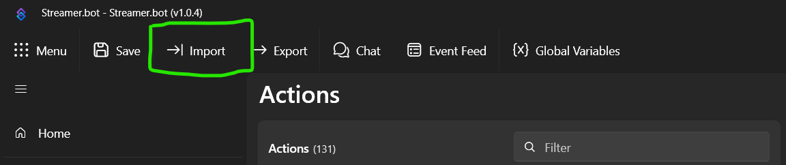
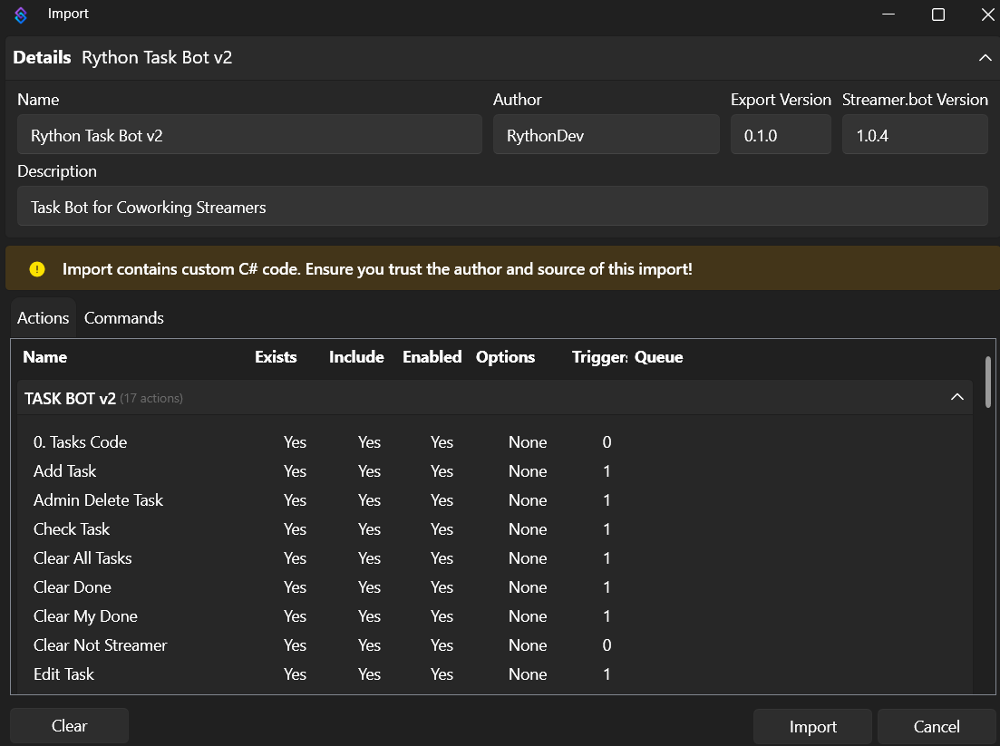

# Rython Task Bot v2

Task Bot for Co-working streamers on Twitch & YouTube.

## Why this Task Bot?

- Browser Source is optional
  - You only need Streamer.Bot running to have it working with Twitch chat
- Compatible with Twitch and YouTube; possibly extending to Kick and Trovo
- Task data is accessible via Streamer.Bot global variable
- Commands' permissions are easily configurable:
  - Mod (and Streamer) only
  - VIP and above
  - Subscribers and above
  - etc.
- Easy customizable with other Streamer.Bot actions

## Setup Instructions

1. Install and setup [Streamer.Bot](https://streamer.bot/)
   - [Nutty's Reference Video](https://youtu.be/gfGy1gRH5ik?t=146) 

2. Open Streamer.Bot and click on Import

   > 

3. Import the string from [RythonTaskBot.sb](./RythonTaskBot.sb)

    - Copy paste the string into the `Import` box

        OR

    - Drag the file into the `Import` box

    > 

4. Click on the `Import` button

5. You may need to go to the Commands tab and enable the commands.

## Usage

### Add task:

- `!task <task name>`

    Aliases:
    - `!a`
    - `!add`
    - `!taskadd`

### Edit task:

- `!edit <number> <task name>`
    
    Aliases:
    - `!e`
    - `!taskedit`

### Complete task:

- `!done <number>`
- `!done <task name>`
    
    Aliases:
    - `!f`
    - `!finish`
    - `!complete`

### Remove task:

- `!remove <number>`

### Admin delete user's tasks:

- `!adel @username`
    
    Aliases:
    - `!admindelete`

(Work in progress)

## Credits

- [RythonDev](https://twitch.tv/RythonDev)
